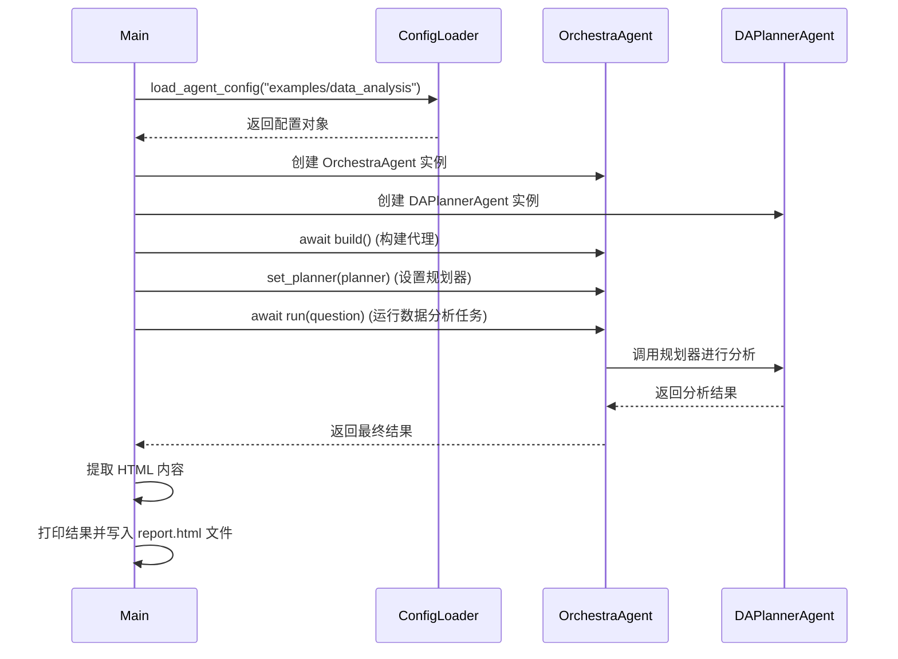

```mermaid
sequenceDiagram
    participant Main
    participant ConfigLoader
    participant OrchestraAgent
    participant DAPlannerAgent

    Main->>ConfigLoader: load_agent_config("examples/data_analysis")
    ConfigLoader-->>Main: 返回配置对象
    Main->>OrchestraAgent: 创建 OrchestraAgent 实例
    Main->>DAPlannerAgent: 创建 DAPlannerAgent 实例
    Main->>OrchestraAgent: await build() (构建代理)
    Main->>OrchestraAgent: set_planner(planner) (设置规划器)
    Main->>OrchestraAgent: await run(question) (运行数据分析任务)
    OrchestraAgent->>DAPlannerAgent: 调用规划器进行分析
    DAPlannerAgent-->>OrchestraAgent: 返回分析结果
    OrchestraAgent-->>Main: 返回最终结果
    Main->>Main: 提取 HTML 内容
    Main->>Main: 打印结果并写入 report.html 文件
```